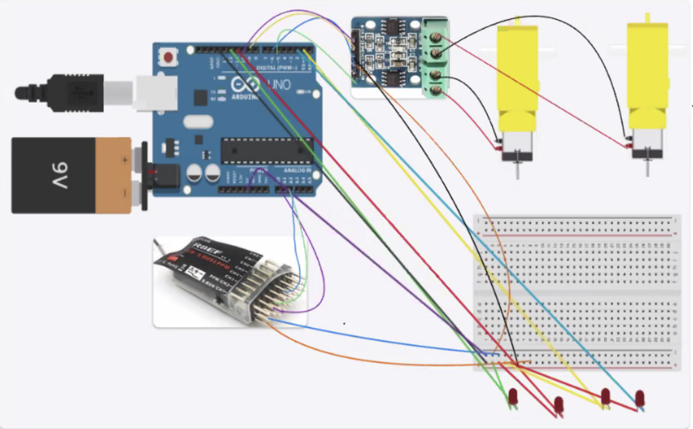

# Remote Controlled Tank Robot 
My project is a remote control robot that started as a base project with the basic robot with to moters connected to a H-Bridge,which controls the moters,and wired it to a audrino. It was coded to go in all directions autonomusly before I wired a reciver to the audrino and coded it to be controled through the remote control as well as turn on 4 LEDs through a switch on the controler. 

| **Engineer** | **School** | **Area of Interest** | **Grade** |
|:--:|:--:|:--:|:--:|
| Max G | Rambam | Aerospace Engineering | Junior | 


  
# Final Milestone


My final milestone is wiring and coding 4 LEDs into the robot to be turned on or off through a switch. This required me to read the values that are inputed through the switch but didn't require me to change the values to a range of 0-255 like with the other controls because I wasn't controling any moters. This made the coding a lot easier as I was able to find the code to light up the LEDs through the audrino coding platform and I didn't have to create a compleatly new map statment for this control.   

# Second Milestone


<iframe width="560" height="315" src="https://www.youtube.com/embed/uQQ-qNGzbPk?si=od-SM9rmRN0YnEf9" title="YouTube video player" frameborder="0" allow="accelerometer; autoplay; clipboard-write; encrypted-media; gyroscope; picture-in-picture; web-share" referrerpolicy="strict-origin-when-cross-origin" allowfullscreen></iframe>


My second milestone is making my robot controlable via a remote controller and connecting the reciever to the audrino. This was especally difficult since the controller sends values to the audrino through the reciever in a range of 1000-2000 while the moters are only able to take in values in a range of 0-255. Because of this I had to code my robot to read the values from the controller and then map the values into a range of 0-255. Then I had to code the robot to do certin controls depending on the values send by the controller for each of it's inputs. This took a lot of work and troubleshooting both in the code and with the robot itself and is by far the most challenging part of my project.        

# First Milestone

<iframe width="560" height="315" src="https://www.youtube.com/embed/IsBcdR4jaYs?si=Tsa2o6ey2dKBQGOx" title="YouTube video player" frameborder="0" allow="accelerometer; autoplay; clipboard-write; encrypted-media; gyroscope; picture-in-picture; web-share" referrerpolicy="strict-origin-when-cross-origin" allowfullscreen></iframe>


My first milestone is the compleation of the of my base project,compleat with two moters and H-bridge wired to the audrino. The moters are connected to the H-bridge which sends a series of electric pulses to the moters to activate them depending on what it recives from the audrino.I also compleated some sample code that allowed me to see how my robot would operate and to give me a idea of what code to write for my modifications. One problem I faced was that while the moter on the right side ran according to the code, the left moter didn't and instead continuously ran and didn't stop at the designated time in my code. Another problem was that the moters ran in oppisite directions. After test running my code and troubleshooting I found out the problems were due to a falty wire and minor errors in my code.  

# Schematics 

# Code


```c++
#include <EnableInterrupt.h>

#define SERIAL_PORT_SPEED 9600
#define RC_NUM_CHANNELS  4

#define LED_pin 2
#define LED_pin1 3
#define LED_pin2 11
#define LED_pin3 12

const int A_1B=5;
const int A_1A=6;
const int B_1B=9;
const int B_1A=10;

#define RC_CH1  0
#define RC_CH2  1
#define RC_CH3  2
#define RC_CH5  3

#define RC_CH1_INPUT  A0
#define RC_CH2_INPUT  A1
#define RC_CH3_INPUT  A2
#define RC_CH5_INPUT  A3

uint16_t rc_values[RC_NUM_CHANNELS];
uint32_t rc_start[RC_NUM_CHANNELS];
volatile uint16_t rc_shared[RC_NUM_CHANNELS];

void rc_read_values() {
  noInterrupts();
  memcpy(rc_values, (const void *)rc_shared, sizeof(rc_shared));
  interrupts();
}

void calc_input(uint8_t channel, uint8_t input_pin) {
  if (digitalRead(input_pin) == HIGH) {
    rc_start[channel] = micros();
  } else {
    uint16_t rc_compare = (uint16_t)(micros() - rc_start[channel]);
    rc_shared[channel] = rc_compare;
  }
}

void calc_ch1() { calc_input(RC_CH1, RC_CH1_INPUT); }
void calc_ch2() { calc_input(RC_CH2, RC_CH2_INPUT); }
void calc_ch3() { calc_input(RC_CH3, RC_CH3_INPUT); }
void calc_ch5() { calc_input(RC_CH5, RC_CH5_INPUT); }

void setup() {
  Serial.begin(SERIAL_PORT_SPEED);

  const int A_1B=5;
  const int A_1A=6;
  const int B_1B=9;
  const int B_1A=10;

  pinMode( LED_pin, OUTPUT);
  pinMode( LED_pin1, OUTPUT);
  pinMode( LED_pin2, OUTPUT);
  pinMode( LED_pin3, OUTPUT);
  pinMode(A_1B,OUTPUT);
  pinMode(A_1A,OUTPUT);
  pinMode(B_1B,OUTPUT);
  pinMode(B_1A,OUTPUT);
  
  pinMode(RC_CH1_INPUT, INPUT);
  pinMode(RC_CH2_INPUT, INPUT);
  pinMode(RC_CH3_INPUT, INPUT);
  pinMode(RC_CH5_INPUT, INPUT);

  enableInterrupt(RC_CH1_INPUT, calc_ch1, CHANGE);
  enableInterrupt(RC_CH2_INPUT, calc_ch2, CHANGE);
  enableInterrupt(RC_CH3_INPUT, calc_ch3, CHANGE);
  enableInterrupt(RC_CH5_INPUT, calc_ch5, CHANGE);
}

void loop(){ 
  rc_read_values();
  
  Serial.print("CH2:"); Serial.print(rc_values[RC_CH2]); Serial.print("\t");
  Serial.print("CH3:"); Serial.print(rc_values[RC_CH3]); Serial.print("\t");
  Serial.print("CH5:"); Serial.println(rc_values[RC_CH5]);
  
  int newCH2=map(rc_values[RC_CH2], 1000, 1984, 0, 254);
  int newCH3=map(rc_values[RC_CH3], 1012, 1988, 0, 254);
  
  Serial.print("CH2:"); Serial.print(newCH2); Serial.print("\t");
  Serial.print("CH3:"); Serial.print(newCH3); Serial.print("\t");

  if (newCH2 < 115 and newCH3 > 155) {
   moveForward();
 //  Serial.print("moving foward right"); 
  }
  else if (newCH2 > 135 and newCH3 < 125) { 
   moveBackward();
 //  Serial.print("moving back right"); 
  }
 else if (newCH3 > 155 and newCH2 > 135) {  
   turnRight();
  //Serial.print("moving foward left");
 }                      
 else if (newCH3 < 125 and newCH2 < 115) {  
  turnLeft();
  // Serial.print("moving back left"); 
 }
 else {
  stopMove();
  //Serial.print("stop_left");

 }

 if (rc_values[RC_CH5] < 1600) {
  digitalWrite(LED_pin, HIGH); 
  digitalWrite(LED_pin1, HIGH);
  digitalWrite(LED_pin2, HIGH);
  digitalWrite(LED_pin3, HIGH); 
 }
 else if (rc_values[RC_CH5] > 1600) {
   digitalWrite(LED_pin, LOW); 
   digitalWrite(LED_pin1, LOW);
   digitalWrite(LED_pin2, LOW); 
   digitalWrite(LED_pin3, LOW); 
 }


} 

 void moveForward(){
 digitalWrite(A_1B,LOW);
 digitalWrite(A_1A,HIGH);
 digitalWrite(B_1B,HIGH);
 digitalWrite(B_1A,LOW);
}

void moveBackward(){
 digitalWrite(A_1B,HIGH);
 digitalWrite(A_1A,LOW);
 digitalWrite(B_1B,LOW);
 digitalWrite(B_1A,HIGH);
}

void turnRight(){
 digitalWrite(A_1B,HIGH);
 digitalWrite(A_1A,LOW);
 digitalWrite(B_1B,HIGH);
 digitalWrite(B_1A,LOW);
}

void turnLeft(){
 digitalWrite(A_1B,LOW);
 digitalWrite(A_1A,HIGH);
 digitalWrite(B_1B,LOW);
 digitalWrite(B_1A,HIGH);
}

void stopMove(){
 digitalWrite(A_1B,LOW);
 digitalWrite(A_1A,LOW);
 digitalWrite(B_1B,LOW);
 digitalWrite(B_1A,LOW);
}
```

# Bill of Materials

| **Part** | **Note** | **Price** | **Link** |
|:--:|:--:|:--:|:--:|
| Chasis | Used as the general frame of the robot. | $21.59 | <a href="https://www.amazon.com/TT02-Platform-Intelligent-Programmable-Educational/dp/B09V7T97RV/ref=sr_1_47?crid=OXLYH16H0GCU&dib=eyJ2IjoiMSJ9.IM0-vS-C-EGGeZYPYXycjiXnG-UaAN6F61k0uty1Gf7Zvh0napnIRqRGXq1IuD22hytT-vmhd517ZuEX4QTx0YLj-6Xg1qHbgq3-vFyBcnlffdq2mZMUjN7AM_enxzh168BCgy0heilUD6DuBDiMzeHFkUTl1EjzQ98hOqhX5u24U1Nehqhf7Ot1z9d6AcONjE8dUF-8R9fZHt91E9R1Q-m4MhMf5zKtI3DnhkOBo5FZ5KPHlLhPEG_bODR0o3NHvJ0jqsxNEJQuowLBlAuiZgpOM8AC42cBm014iuePsQg.xYj8I09trrOmQtlIo38ceHxknzHL5CnbhTfQMkfImSA&dib_tag=se&keywords=tank%2Brobot%2Barduino&qid=1718756297&sprefix=tank%2Brobot%2Barduino%2Caps%2C106&sr=8-47&th=1"> Link </a> |
| Audrino Uno Clone | Accepts all the code for the robot and runs the actions for the robot accordingly. | $14.98 | <a href="https://www.amazon.com/ELEGOO-Board-ATmega328P-ATMEGA16U2-Compliant/dp/B01EWOE0UU/ref=sr_1_2_sspa?crid=3A6NCD2X9JEMJ&dib=eyJ2IjoiMSJ9.AcWZy-Yg4mDTnhzEHozxzPZdVC5-KUL2tW-OQewDKpBB4brSpD-p4bn74WcXiW3KarYertgpNaLJ0VHKx0qsPqolKAhiz1GRG5BwJQl73cEvrlXIXNmqlpSvU7uu2aRVSwAZi9Gj2AjSPLM3esW1Gzy9xEiQ9oiR5LCNjh4MlYDx5mTm5sI4rsD4CFTipJnF572qXlickl35FRcCj8oMXQotumgqI4yEIq0HobOtIlEnNhtVB51JMBHhqtmmF_PC9WeHJ4ySUVVcv_gq3_VeG1aAEbdm4NXmmT6NOYPw4Qo.1PFdgFT22oqO5Mg6-6j_aUL_EV8tUPuaFrB5N9oaEX0&dib_tag=se&keywords=elegoo+arduino&qid=1716856465&s=electronics&sprefix=elegoo+arduino%2Celectronics%2C99&sr=1-2-spons&sp_csd=d2lkZ2V0TmFtZT1zcF9hdGY&psc=1"> Link </a> |
| Electronics Kit | Provides extra wires and components that can be used as needed. | $12.79 | <a href="https://www.amazon.com/dp/B09YRJQRFF?smid=A2WWHQ25ENKVJ1&ref_=chk_typ_imgToDp&th=1"> Link </a> |
| Moters | Used to move the treads of the robot and allow it to move. | $11.98 | <a href="https://www.amazon.com/AEDIKO-Motor-Gearbox-200RPM-Ratio/dp/B09N6NXP4H/ref=sr_1_4?crid=1JP29NIWBLH2M&dib=eyJ2IjoiMSJ9.Wq3jKgOLbqtEP772vMD4pV5f-w3PLBdEpKqguykXOb0JFO14f4Dq0m_VDVUMUFtR8WFINUEticI3GXcoGqwXPqK9yIh04PhCktgccMz9zAUiKXMJPwmOTUp_6av3XuFD0lXo9WngN9iKI6YgZrhEEs9qnqbcB1GnvgntCdKz8Q1dFuNu61NgSE6Z8vBk3FRpaNcr1lCI7FApTiNi0Qce8gbfmMn6oUggZQHpIOKKZ6s.M7WsZ_ZZtm3rm93kKgw0NOxt1McVBYX6m55oGxu1xxI&dib_tag=se&keywords=dc+motor+with+gearbox&qid=1715911706&sprefix=dc+motor+with+gearbox%2Caps%2C126&sr=8-4"> Link </a> |
| H Bridges | Receives the code for the moters from the Audrino and runs it for the moters. | $8.99 | <a href="https://www.amazon.com/gp/product/B00M0F243E/ref=sw_img_1?smid=A30QSGOJR8LMXA&psc=1"> Link </a> |
| DMM | Helps with debugging. | $11.00 |  <a href="https://www.amazon.com/AstroAI-Digital-Multimeter-Voltage-Tester/dp/B01ISAMUA6/ref=sxin_17_pa_sp_search_thematic_sspa?content-id=amzn1.sym.e8da13fc-7baf-46c3-926a-e7e8f63a520b%3Aamzn1.sym.e8da13fc-7baf-46c3-926a-e7e8f63a520b&cv_ct_cx=digital+multimeter&dib=eyJ2IjoiMSJ9.5LQumrfBR8l0mKnJCJlRg73dxpou0gqYD_ffU3srgs0Utegwth8GcQCSVXVzeZeLSJx5J3itz5TLdmJHsrVITQ.-00jRPoT-bBy26YC4LzQ-S4cYdztgmSMGb83_WEm6HY&dib_tag=se&keywords=digital+multimeter&pd_rd_i=B01ISAMUA6&pd_rd_r=e1ff2570-7e4a-4906-bc55-6f819d48d1bc&pd_rd_w=h7HgL&pd_rd_wg=0ZcFH&pf_rd_p=e8da13fc-7baf-46c3-926a-e7e8f63a520b&pf_rd_r=R6YKX3NXTDQ1PQP4H8RM&qid=1715911879&sbo=RZvfv%2F%2FHxDF%2BO5021pAnSA%3D%3D&sr=1-1-7efdef4d-9875-47e1-927f-8c2c1c47ed49-spons&sp_csd=d2lkZ2V0TmFtZT1zcF9zZWFyY2hfdGhlbWF0aWM&psc=1"> Link </a> |
| 9V Barrel Jack | Allows for a 9 volt battery to be connected to the Audrino to power the robot | $5.99 |  <a href="https://www.amazon.com/5pack-Battery-2-1mm-Arduino-Corpco/dp/B01AXIEDX8/ref=sr_1_1?crid=1JMB76PI0E2LI&dib=eyJ2IjoiMSJ9.IxZhvVZzjl3mQ3hiFiq1KUOMvd6aWLHUvR5GaRVLvnLpCADw7ptUhm2ZbswcLA3OH-Srpw2qShEwZO-p10V1B08qcOrt0gncPdblQgSH8a_6PHpQ4-_vInA0lzCwWExsJlLpqvGmmsfJvBWkzMQwK15XFLF91dW2yPDl3lBPwRh1puqCFY1goDEn2acNaXvnhlfi_zHFc0AIek0u-9jV-YAmlN9oJPKaoz-6CPWMNs8_wBzmKTDVV8sra3clevWH3BHfH5dBOAWjjR5Fr-MvPr5f6THNw3WOMLeeKYAuS2E.8BHZWnq0i61MogcAFoJqxvFR64QYbjBONOTda2bvQE4&dib_tag=se&keywords=9v+battery+to+barrel&qid=1718991115&s=electronics&sprefix=9v+battery+to+barrel%2Celectronics%2C86&sr=1-1"> Link </a> |
| 9V Batteries | Powers the robot. | $8.88 | <a href="https://www.amazon.com/Amazon-Basics-Performance-All-Purpose-Batteries/dp/B00MH4QM1S/ref=sr_1_5_pp?crid=3TQ7ANPH958JM&dib=eyJ2IjoiMSJ9.bmcV2Upj_vpB6G9CFlPPxYAryat512da7ekZjc52HecXSTmtx7PbJ50EgQFPCMqlAxjOUq-tL4vQTpozlHvH89bMwx-HJoyGcdz6EY8HrMxahTiqOXkoP7ewkDcgHoMhmHamdlQfW6FBHO0Gm-DYZZnnMuvEU3qOpemA8PGEvRhEx4-lGaBZhrvls039G1-9SizAW-YRGXZ2fFrdVDlREyyOhAuxXZaE5QqUxWesRQgP9UfGOYaInRWTTPwhDbXFa-RPzGbU1C_u4wq-NMqKBtWEQqR9-cA8O3FYOx3icEY.dtKJmI2T-iCmMM_bYnbiHUWzhKpJDRxS-bBmZIwYFKM&dib_tag=se&keywords=9v%2Bbatteries&qid=1720651326&rdc=1&s=electronics&sprefix=9v%2Bbatteries%2Celectronics%2C105&sr=1-5&th=1"> Link </a> | 
| Remote Control | Allows for compleate control of the robot's movements. | $54.99 | <a href="https://www.amazon.com/Radiolink-Channels-Transmitter-Controller-Rechargeable/dp/B09BTSJN7P?th=1"> Link </a> |
